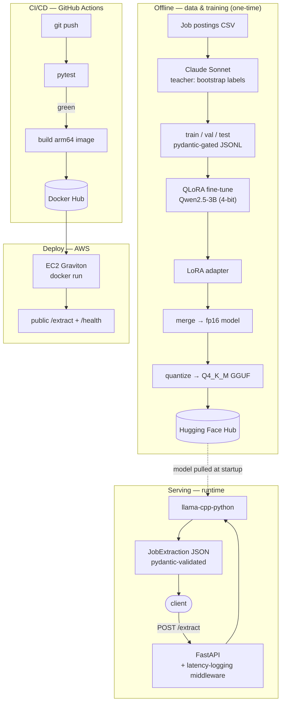

# Fine-Tuned LLM Microservice — Structured Extraction from Job Postings

A small open LLM (**Qwen2.5-3B-Instruct**) fine-tuned with **QLoRA** to extract structured data from job postings, then shipped as a containerized, monitored API on **AWS** with a full **CI/CD** pipeline. The point wasn't a bigger model — it was taking one model the whole distance to production: **fine-tune → evaluate → serve → deploy → operate.**

Turn a raw job posting into structured JSON:
`{ required_skills, tech_stack, seniority, avg_comp_range }`.

## Results — fine-tuned vs. the same base model (zero-shot)

Field-level accuracy on a held-out test set (29 postings), identical greedy decoding:

| Field | Base (zero-shot) | Fine-tuned | Δ |
|---|---|---|---|
| seniority | 0.72 | 0.76 | +0.03 |
| comp (±10%) | 0.86 | 0.97 | +0.10 |
| skills (set-F1) | 0.17 | 0.27 | +0.10 |
| tech_stack (set-F1) | 0.08 | 0.68 | **+0.60** |
| valid-JSON rate | 1.00 | 1.00 | — |

The headline is **`tech_stack` (0.08 → 0.68)**: fine-tuning taught the model to cleanly separate *named technologies* (Python, PyTorch, AWS, Docker) from general *competencies*, which the base model conflated. Getting there took a diagnostic detour — the **first** fine-tune actually *regressed* (60% valid-JSON) due to degenerate repetition loops under greedy decoding. Printing the raw generations traced the cause to **thin/noisy training data, not the decoding**; doubling and cleaning the dataset lifted valid-JSON to 100% and turned it into an across-the-board win.

## Architecture



## Model roles (the North Star = the delta)
- **Teacher** — Claude Sonnet; generated labels once, offline. Never shipped or compared.
- **Baseline** — Qwen2.5-3B, zero-shot. Measured *before* fine-tuning.
- **Student** — Qwen2.5-3B + LoRA adapter. What ships. The reported result is `Student − Baseline`.

## Tech stack
- **Model / training:** Qwen2.5-3B-Instruct, QLoRA (PEFT, bitsandbytes 4-bit), Hugging Face Transformers/TRL
- **Serving:** FastAPI, `llama-cpp-python` (CPU, Q4_K_M GGUF), pydantic validation
- **Infra:** Docker, GitHub Actions (CI/CD), Docker Hub, AWS EC2 (Graviton/ARM)
- **Model artifacts (HF Hub):** [adapter](https://huggingface.co/tkatz123/qwen2.5-3b-job-extraction) · [merged](https://huggingface.co/tkatz123/qwen2.5-3b-job-extraction-merged) · [GGUF](https://huggingface.co/tkatz123/qwen2.5-3b-job-extraction-gguf)

## Run it locally
```bash
# service deps (CPU llama-cpp-python wheel)
pip install -r requirements-service.txt

# start the API (pulls the Q4_K_M GGUF from HF on first run)
uvicorn app.main:app --port 8000 --no-access-log
# → http://localhost:8000/docs
```

Example request:
```bash
curl -s -X POST http://localhost:8000/extract \
  -H "Content-Type: application/json" \
  -d '{"job_description": "Senior ML Engineer. 6+ years Python, PyTorch, AWS, Docker. Build and ship LLM services. $180k-$220k."}'
```
Response:
```json
{
  "required_skills": ["machine learning engineering", "model deployment", "AWS infrastructure", "containerization"],
  "tech_stack": ["Python", "PyTorch", "AWS", "Docker"],
  "seniority": "senior",
  "avg_comp_range": 200000
}
```

## Or with Docker
```bash
docker run -p 8000:8000 tkatz123/job-extraction:latest
```

## Repo layout
- `src/` — schema, prompts, label bootstrapping, data split, eval metric
- `app/` — FastAPI service (`main.py`) + inference (`inference.py`)
- `tests/` — pytest suite (eval-metric unit tests)
- `notebooks/` — QLoRA training + adapter-merge notebooks
- `.github/workflows/ci.yml` — test → build → push pipeline
- `Dockerfile`, `requirements-service.txt` — container

## What I'd do next
- **Serve on a 4 GB instance.** On the free-tier 2 GB box the Q4 model is RAM-bound — the weights don't stay resident, so inference goes disk-bound and latency balloons. A 4 GB instance keeps the model in memory and drops latency to seconds; this is a documented cost/performance knob rather than a code change.
- **Improve the `required_skills` field.** It's the weakest field (set-F1 0.27) — long, free-form lists where exact-set F1 is harsh on wording. Levers: more/cleaner training labels, or a semantic-match metric instead of exact set overlap.
- **Close the monitoring loop.** Request logging + per-request latency are in place; a `/metrics` endpoint or a CloudWatch dashboard would turn those logs into charts and alerts.

## Author

Tyler Katz

M.S. in Applied Human Centered Artificial Intelligence, Class of 2027
Syracuse University

B.S. in Applied Data Analytics, Class of 2026
Syracuse University

[GitHub Profile](https://github.com/tkatz123) • [LinkedIn](https://www.linkedin.com/in/tylerkatz1/)

## License

This projest is licensed under the MIT Licesne. See the LICESNE for details.
